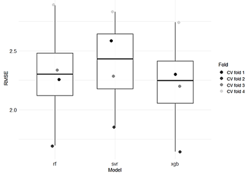
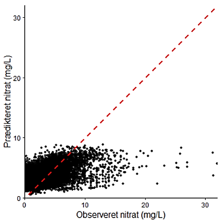
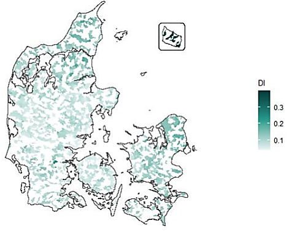

# Predicting Nitrate Concentrations in Danish Streams - Master Thesis Project in Business Intelligence at Aarhus University. 

## Project Overview 

The project investigates whether machine learning models can predict nitrate concentrations in danish streams and generalize to geographically unseen areas. 

## Problem 

Environmental data are spatially dependent. A random train/test split can therefore produce overly optimistic estimates of model performance because nearby observations may appear in both training and test data. This project evaluates the models using spatially separated validation. 

## Data

The project integrates environmental, hydrological, meteorological, agricultural and spatial data from multiple danish data sources. The original nitrate dataset contained 63,471 measurements from danish streams between 2016-2023. 

## Data Preparation

The project involved collecting, cleaning and integrating multiple spatial and tabular data sources. Environmental observations were linked with hydrological, meteorological, agricultural and geographical features.

The workflow included:
- Data cleaning and quality assessment
- Integration of multiple data sources
- Spatial joins and geographical feature engineering
- Aggregation of observations
- Handling missing values and transformations
- Preparation of data for spatial machine learning

## Methods

**Models**
- XGBoost
- Random Forest
- Support Vector Regression

**Model development and evaluation**
- Nested spatial cross-validation
- Hyperparameter tuning
- RMSE, MAE and R²
- Feature importance
- Residual analysis
- Moran's I
- Area of Applicability

## Results

XGBoost achieved the strongest predictive performance. 

- RMSE: 2.22
- MAE: 1.59
- R^2: 0.29

The models showed substantially lower performance on geographically unseen test areas than on training data, highlighting the difficulty of spatial generalization.

## Model limitations

The XGBoost model tended to underestimate high nitrate concentrations, particularly at environmentally critical levels.

## Geographical applicability

The Area of Applicability analysis showed that approximately 94.4% of observations were located within the model's prediction space. Areas with higher dissimilarity to the training data generally also showed larger prediction errors.

## Key takeaways

- Machine learning can support spatial prediction of nitrate concentrations, but generalization to geographically unseen areas remains challenging.
- XGBoost achieved the strongest performance, although the model tended to underestimate high nitrate concentrations.
- Approximately 94.4% of observations were within the model's Area of Applicability, while predictions outside this space involved greater extrapolation uncertainty.
- Residual spatial autocorrelation indicated that important spatial processes were still not fully captured by the available features.
- The project demonstrates the importance of realistic spatial validation. Strong performance from random train/test splits does not necessarily translate into reliable predictions in new geographical areas.

## Technologies and Skills

R | Machine Learning | Spatial Data | Data Integration | Feature Engineering | Model Validation | XGBoost | Random Forest | Support Vector Regression
